# Desplliegue de una aplicacion en cluster con NodeJS y Express
    - Lo primero que vamos ha hacer es intalar nodejs ya que no esta instalado.

## Sin cluster
- Creamos una carpeta para el proyecto, luego lo iniciamos con npm init para crear una estructura de carpetas automaticamente y el archivo packega.json.

- Lo siguiente es hacer un npm install expres para instalarlo para el proyecto 

- Despues de esto creamos con nano un archivo para la aplicacion.js y añadimos lo siguiente y ejecutamos node "nombre de nuestra applicación"

- En este momento me sale un error, que sucede por que la instalacion de node es una version antigua y los datos dentro de la aplicacion necesitan un node mas moderno, para esto tenemos que hacer lo siguiente
    - Borrar node.
    
    - Reinstalarlo, con una version mas actual 
    
    - Comprobamos
    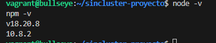
    -Borramos expres por si da fallos
    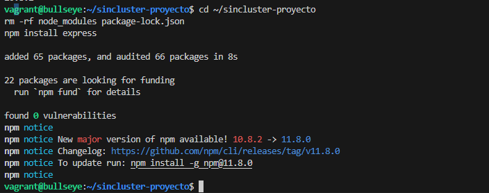
- Ya funcionaria y estaria la aplicacion escuchando por el puerto dicho "3000", para acceder tenemos que saber la ip y poner :3000

-Vemos el tiempo que tarda, y a la vez abrimos otra pagina para ver como el valor sube 
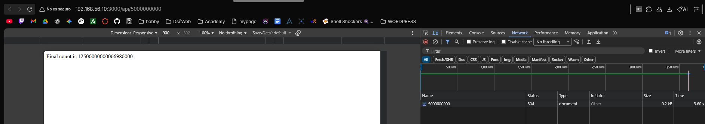
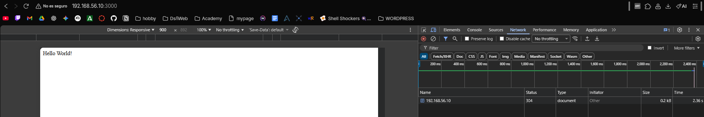
(Esto sucede porque la aplicación sin clúster se ejecuta en unico proceso.)

## Con cluster
- Creamos el archivo con nano y añadimos lo siguiente 
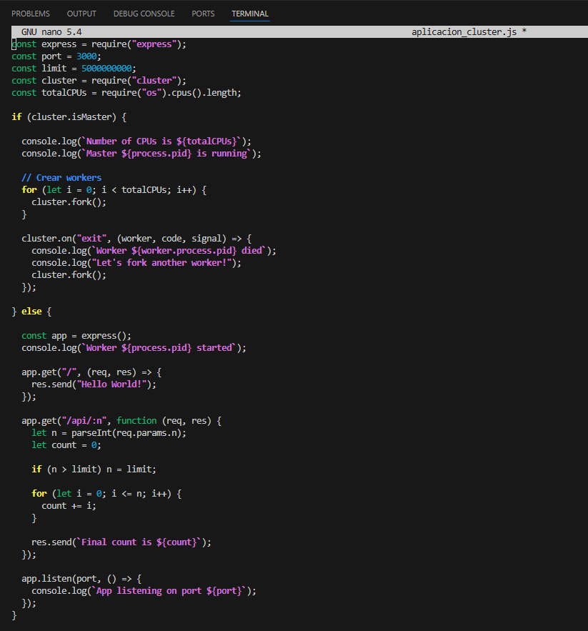
- Ejecutamos la app 
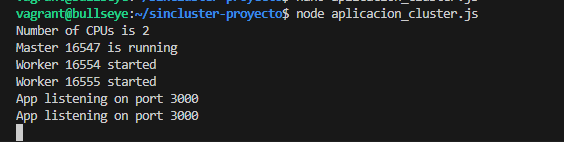
- Comprobamos otra vez los tiempos.
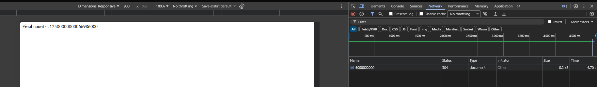
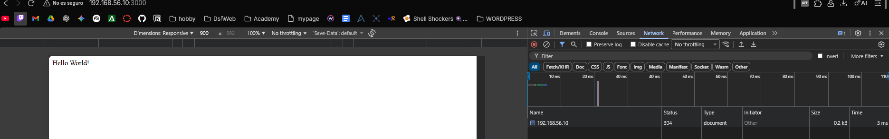
(Esto es debido a que se crean varios procesos workers que comparten el mismo puerto, y las peticiones se distribuyen entre ellos, permitinedo atender a multiples solicitudes evitando bloqueos)

## Metricas de rendimiento
-Instalamos loadtest
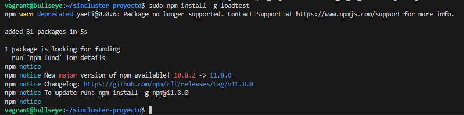
- comprobamos con "loadtest http://localhost:3000/api/500000 -n 1000 -c 100"
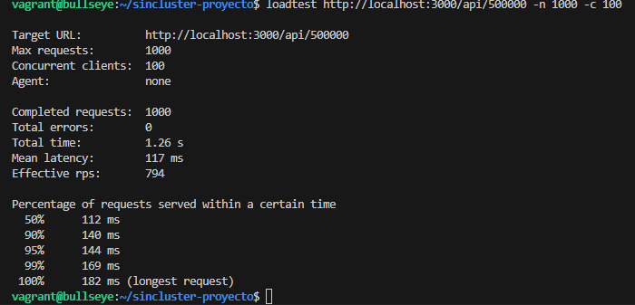
- Ahora lo comprobamos con mas solicitudes "loadtest http://localhost:3000/api/50000000 -n 1000 -c 100"
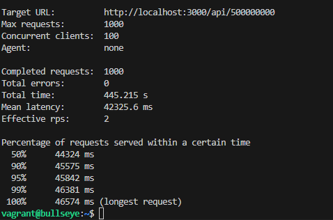

- Y ahora ejecutamos la otra aplicacion que si tiene clusters y ejecutamos lo mismo para ello usamos node "nombre de app con cluster" y comprobamos 
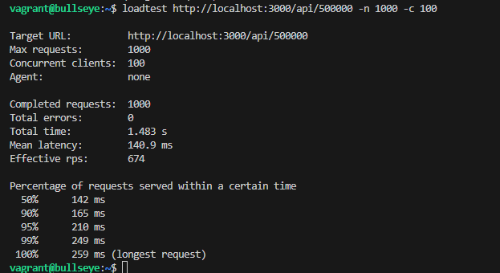
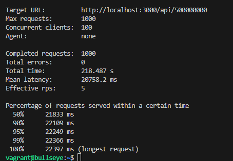

## Uso de PM2 para administrar un clúster de Node.js
- Necesitmos instalarnos pm2 usaremos el comando "npm install pm2 -g" y conprobamos
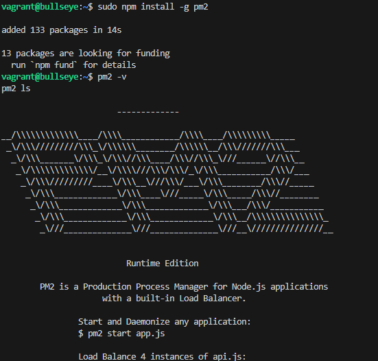
- Lo siguiente es iniciar la aplicaccion sin cluster
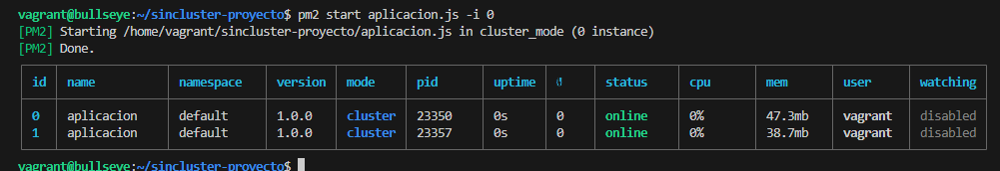

- lo siguiente es descargarnos  pm2 ecosystme "pm2 ecosystem"
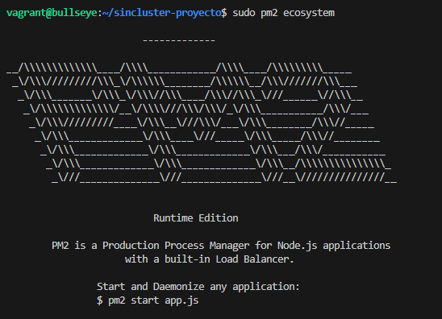
- esto automaticamente nos crea un archivo "ecosystem.config.js" cual tenemos que configurar.
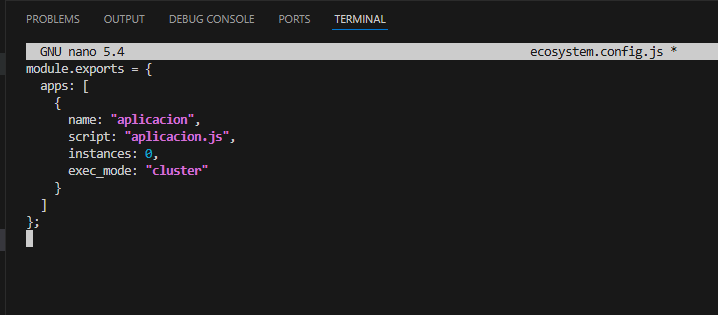
iniciamos
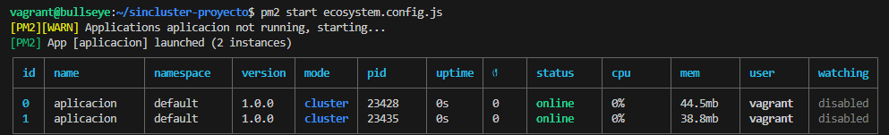
    - pm2 ls 
    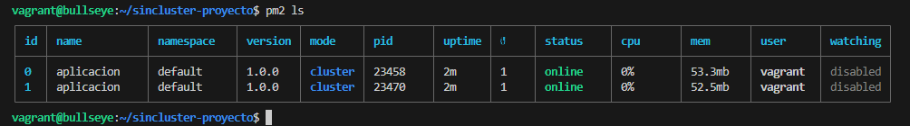
    - pm2 log
    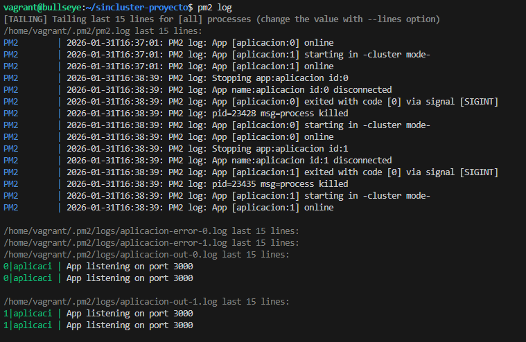
    - pm2 monit
    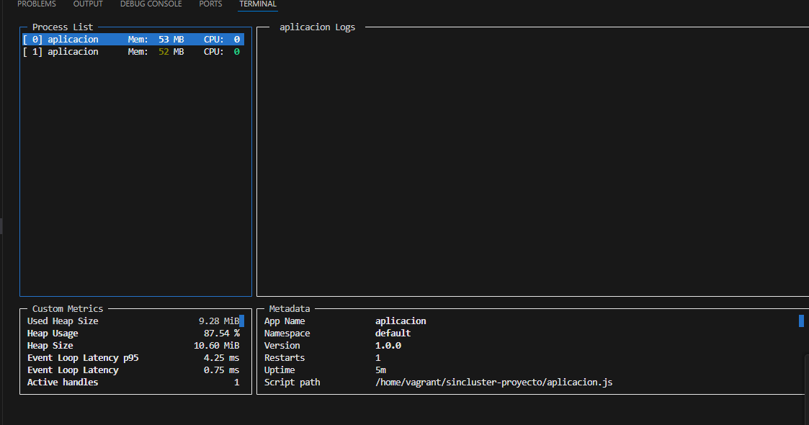

## Cuestionario 
¿Sabrías decir por qué en algunos casos concretos, como este, la aplicación sin clusterizar tiene
mejores resultados?

- En algunos casos la aplicación sin clúster funciona incluso mejor porque montar un clúster también tiene su trabajo. Al final hay que crear varios procesos y repartir las peticiones entre ellos, y eso consume recursos. Cuando las peticiones son rápidas y la CPU no está muy cargada, un solo proceso puede manejarlas sin problema y va más directo. Por eso, en situaciones así, usar varios workers no aporta gran cosa y la aplicación sin clúster puede rendir mejor.